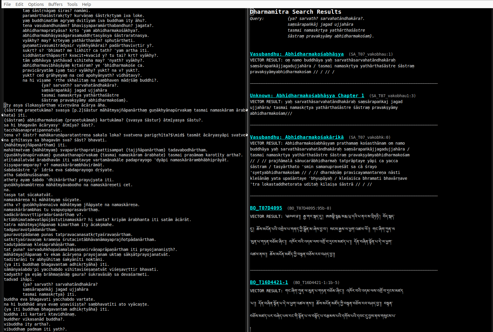

# Dharmamitra Search  

> **Comfortable semantic search of the entire  
> [dharmamitra.org](https://dharmamitra.org) corpus — right from Emacs.**

`dharmamitra-search.el` lets you highlight _any_ text in any buffer, hit a
single key, and instantly browse cross-lingual search results (Sanskrit · Tibetan · 
Chinese · Pāli) returned by Dharmamitra's semantic-search API.

<table><tr><td>



</td></tr></table>

*(screenshot: mark text → `C-c C-d` → clickable results window)*

---

## ✨ Features

| ✔ | Description |
|----|-------------|
| **Zero setup** | Pure-Elisp, no external deps, needs only vanilla Emacs 27+. |
| **Rich results** | Clickable titles open the source page; reference database is not yet up and running, but will come soon. |
| **Non-destructive** | Results appear in their own read-only buffer (derived from `special-mode`). |
| **Customisable** | Endpoint, faces, key binding - all via Emacs' customization UI. |
| **MIT-licensed** | Do whatever you like with it. Contributions welcome! |

---

## ⏳ Installation
<details>
<summary><tt>Manual Installation</tt></summary>

If you don’t use a package manager like <code>straight.el</code>, you can install <code>dharmamitra-search.el</code> manually in just a few steps:

1. **Download the file**

   Clone the repository or download `dharmamitra-search.el` directly from:

   ```
   https://raw.githubusercontent.com/dharmamitra/dharmamitra-search-emacs/main/dharmamitra-search.el
   ```

   Place it in a directory of your choice, for example:

   ```sh
   mkdir -p ~/.emacs.d/lisp/
   cp dharmamitra-search.el ~/.emacs.d/lisp/
   ```

2. **Add it to your load path**

   In your `.emacs` or `init.el` file:

   ```elisp
   (add-to-list 'load-path "~/.emacs.d/lisp/")
   (require 'dharmamitra-search)
   ```

3. **Bind the search command to a key**

   You can customize this as you like. For example:

   ```elisp
   (global-set-key (kbd "C-c C-d") #'dharmamitra-search-region)
   ```

4. **Optional: Customize settings**

   Run `M-x customize-group RET dharmamitra-search RET` to adjust the API endpoint or appearance.

</details>

<details>
<summary><tt>straight.el</tt> / <tt>use-package</tt></summary>

```elisp
(use-package dharmamitra-search
  :straight (dharmamitra-search
             :type git
             :host github
             :repo "https://github.com/dharmamitra/dharmamitra-search-emacs")
  :bind ("C-c C-d" . dharmamitra-search-region))

```
</details>
